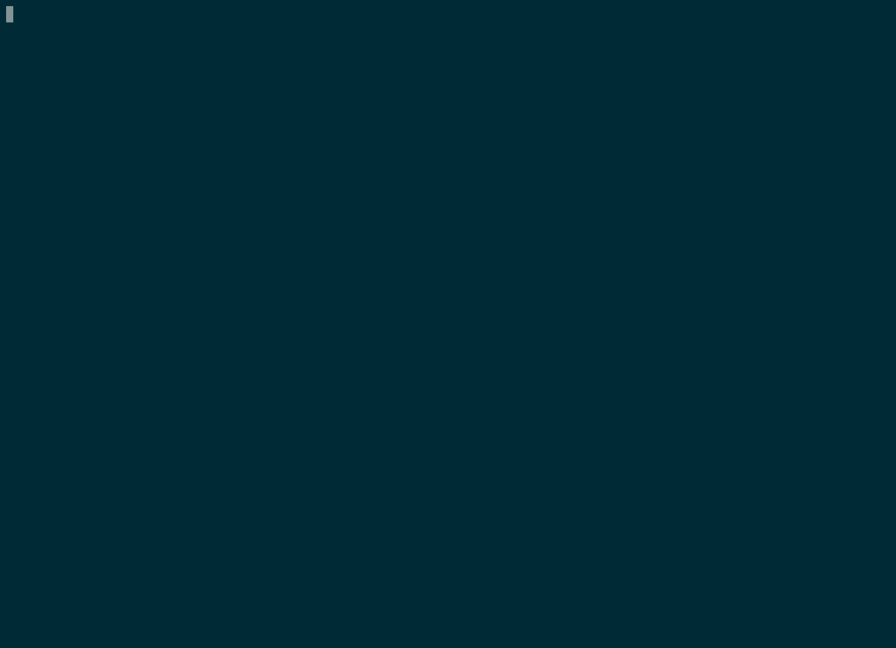

.. ProbeQuest documentation master file, created by
   sphinx-quickstart on Sat May 26 13:03:20 2018.
   You can adapt this file completely to your liking, but it should at least
   contain the root `toctree` directive.

Welcome to ProbeQuest's documentation!
======================================

ProbeQuest is a toolkit allowing to sniff and display the Wi-Fi probe requests passing nearby your wireless interface.

This project has been inspired by `this paper`_.

.. toctree::
    :caption: Table of Contents

    probe_requests
    installation
    usage
    use_case
    mitigation
    modules
    development
    security

.. _this paper: https://brambonne.com/docs/bonne14sasquatch.pdf
