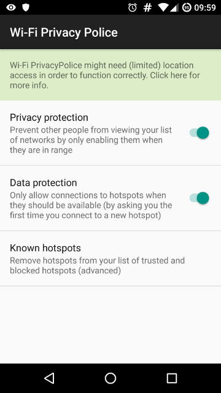

==========
Mitigation
==========

As far as I know, there are two mitigation techniques:

- Don’t use probe requests at all. It is by far the most efficient way not to leak any piece of information. As said earlier, it is not necessary to rely on probe requests to get the list of the nearby access points since they  broadcast their name by themselves.
- Randomise the source MAC address of each probe request sent. This way, it’s no longer possible for a third party to link probe requests to a specific device based on the Wi-Fi data collected. However, using a Software-Defined Radio to capture RF metadata such as the frequency offset, it would be possible to fingerprint each Wi-Fi packet and so each Wi-Fi device, regardless of their source MAC address (this technique will be implemented in ProbeQuest).

In practice, you can install `Wi-Fi Privacy Police`_ from `F-Droid`_ or the `Play Store`_ to prevent your Android devices from leaking their PNL.

Once installed, the **Privacy protection** option should be switched on.

On iOS, the source MAC address is randomised since iOS 8.

.. _F-Droid: https://f-droid.org/packages/be.uhasselt.privacypolice/
.. _Play Store: https://play.google.com/store/apps/details?id=be.uhasselt.privacypolice
.. _Wi-Fi Privacy Police: https://github.com/BramBonne/privacypolice
