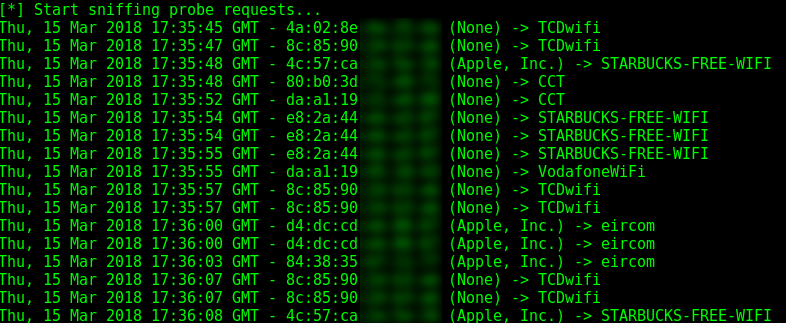

=====
Usage
=====

Enabling the monitor mode
-------------------------

To be able to sniff the probe requests, your Wi-Fi network interface must be set to monitor mode.

With `ifconfig` and `iwconfig`
^^^^^^^^^^^^^^^^^^^^^^^^^^^^^^

::

    sudo ifconfig <wireless interface> down
    sudo iwconfig <wireless interface> mode monitor
    sudo ifconfig <wireless interface> up

For example:

::

    sudo ifconfig wlan0 down
    sudo iwconfig wlan0 mode monitor
    sudo ifconfig wlan0 up

With `airmon-ng` from aircrack-ng
^^^^^^^^^^^^^^^^^^^^^^^^^^^^^^^^^

To kill all the interfering processes:

::

    sudo airmon-ng check kill

To enable the monitor mode:

::

    sudo airmon-ng start <wireless interface>

For example:

::

    sudo airmon-ng start wlan0

Command line arguments
----------------------

.. argparse::
   :filename: ../bin/probequest
   :func: get_arg_parser
   :prog: probequest

Example of use
^^^^^^^^^^^^^^

::

    sudo probequest -i wlan0

Here is a sample output:

